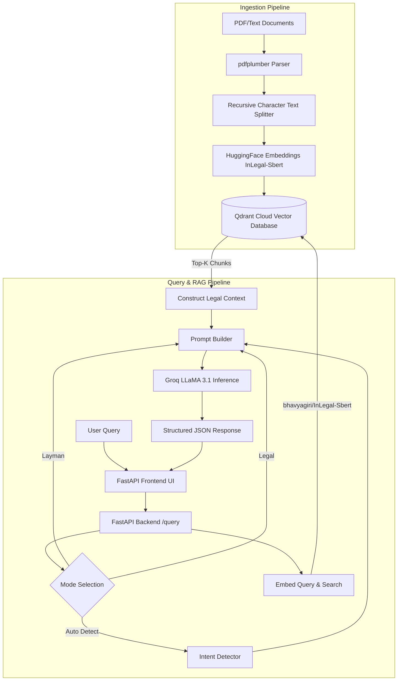
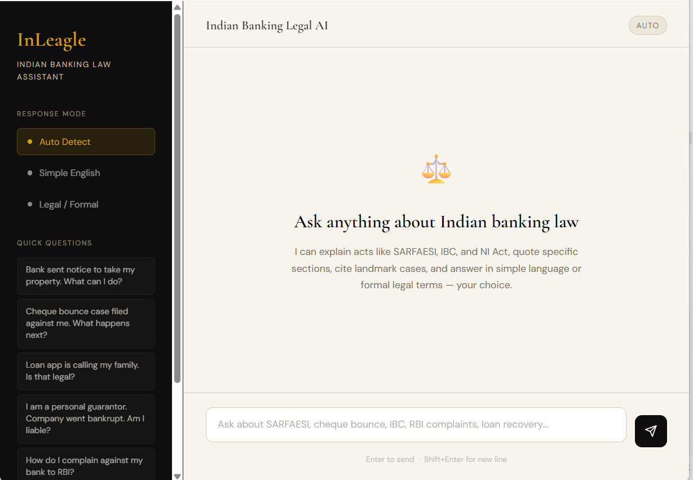
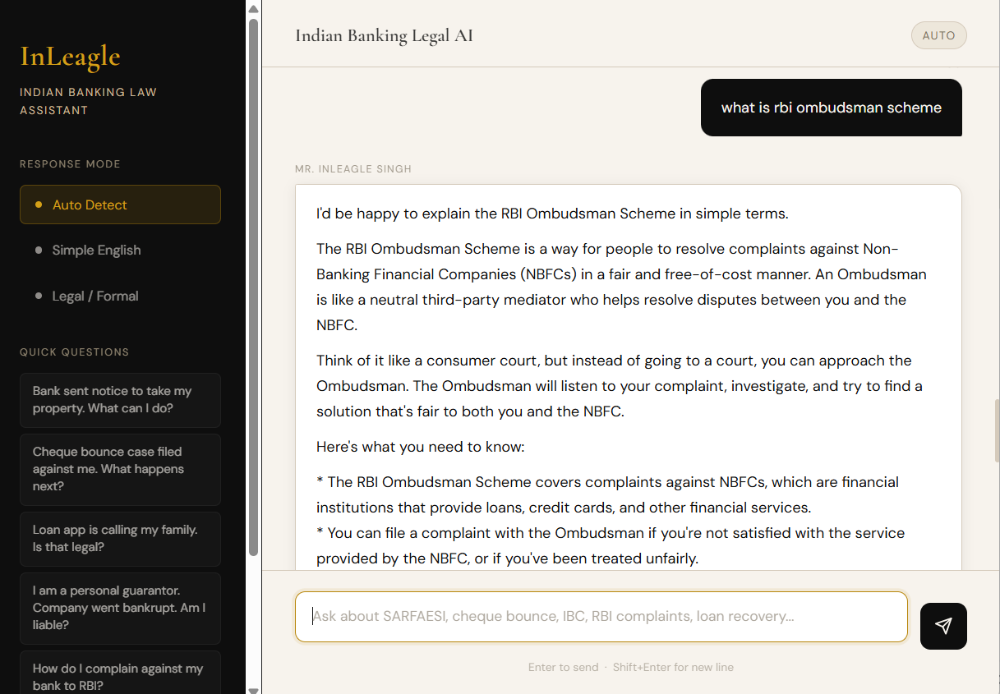
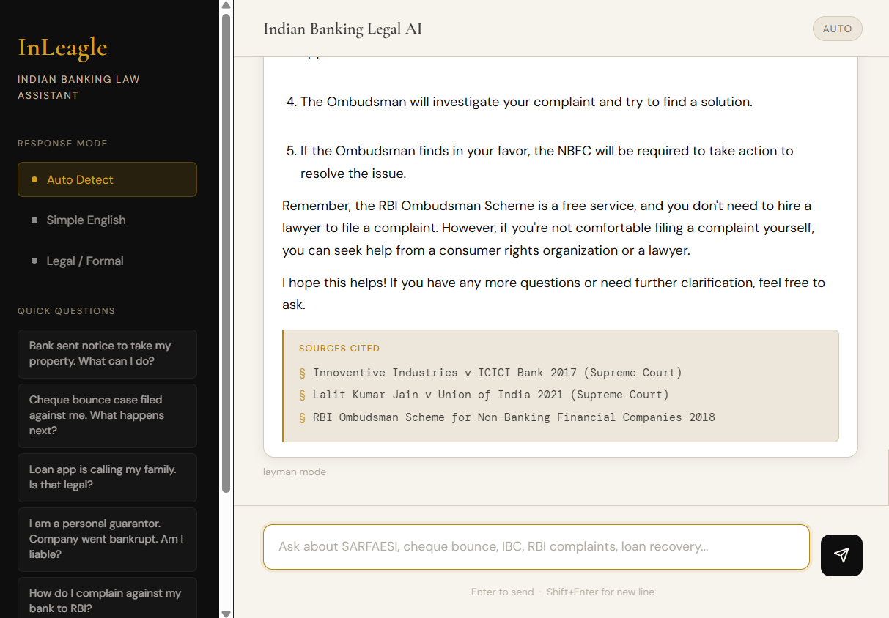
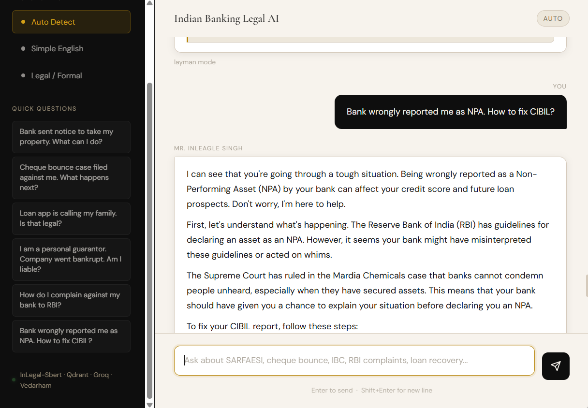
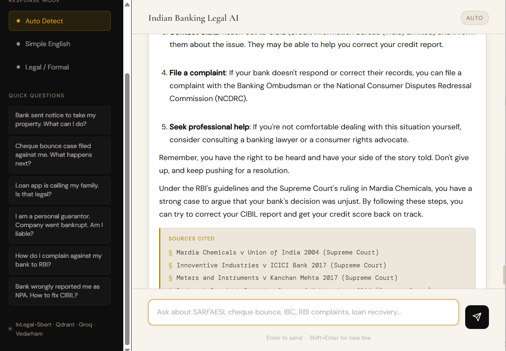

# InLEAGLE: Intelligent Legal Research & Question Answering System for Indian Judiciary

[](https://huggingface.co/spaces)
[](https://www.python.org/)
[](https://qdrant.tech/)
[](https://groq.com/)
[](https://fastapi.tiangolo.com/)

---

## 👥 Project Team Members
* **Arham Sabadra**
* **Arimit Chatterjee**
* **Aryan Jhala**
* **Under the Guidance of:**
  * **Prof. Digendra Singh Rathore**
  * **Mrs. Garima Silkari**
  * *Department of Computer Science & Engineering, Medicaps University, Indore*

---

## 📝 Brief Description
**InLEAGLE** (Intelligent Legal Research & QA System for Indian Judiciary) is an AI-powered legal assistant specialized in Indian banking laws, financial statutes, and central regulations. The system addresses a critical gap in the financial sector where navigating complex banking disputes, loan recovery procedures, and regulatory compliances is highly difficult for individual borrowers, students, and smaller legal practitioners.

By utilizing Retrieval-Augmented Generation (RAG) and semantic search powered by **bhavyagiri/InLegal-Sbert** (fine-tuned on the Indian Legal Corpus), InLEAGLE understands the semantic meaning of natural language queries (such as queries regarding loan recovery, cheque bouncing, and CIBIL disputes) rather than relying solely on keyword matching. The system indexes key statutory acts (e.g., SARFAESI Act, NI Act Section 138, Banking Regulation Act, IBC), central regulatory guidelines (RBI Master Directions on KYC, Fair Practices Code, and Frauds), and landmark banking precedents (such as *Mardia Chemicals*, *Transcore*, *Lalit Kumar Jain*, and *ICICI vs. Shanti Devi*), grounding LLM responses in verifiable citations to prevent hallucinations.

---

## 🛠️ Tech Stack & Tools Used

### 🟢 Active & Implemented Features
* **Legal Embeddings**: `bhavyagiri/InLegal-Sbert` (768-dimensional semantic vectors trained on 27GB of Indian legal text by IIT Kharagpur/OpenNyAI)
* **Vector Database**: `Qdrant` (Persistent vector store, approximate nearest neighbor search via HNSW, cosine distance metric)
* **Language Model (LLM)**: `Meta Llama 3.1` (128K context window, utilized via Groq Cloud API for speed and precision)
* **Orchestration**: `LangChain` (Manages prompt building and LLM-context interaction)
* **PDF Extraction**: `pdfplumber` (Native PDF parsing)
* **Backend Framework**: `FastAPI` (Python REST API for serving model predictions)
* **Frontend**: Responsive Single-Page UI built with HTML, CSS, and Vanilla JavaScript
* **Deployment**: `Hugging Face Spaces` (Public hosting, Docker SDK, exposed port 7860)

### 🟡 Planned / Report Specifications Stack (Pending Integration)
* **Named Entity Recognition (NER)**: `OpenNyAI NER` (Extracts petitioners, respondents, judges, courts, statutes, and precedents with 85%+ F1 score)
* **Scanned PDF OCR**: `Tesseract OCR v5.x` (For scanned legal documents)
* **Database**: `PostgreSQL` / `SQLite` (For case metadata and anonymized user feedback logs)

---

## ⚙️ Features & Functionalities

### 🟢 Active & Implemented Features
#### 1. Semantic Case Search
* **Natural Language Queries**: Users can describe a banking dispute in plain English (e.g., *"What is my remedy if the bank issues a Section 13(2) notice under SARFAESI?"*).
* **Focused Retrieval**: Searches and returns the top 5 semantically relevant statutory sections, RBI master circulars, or judicial precedents from the Qdrant database in under 2 seconds (P90).
* **Expandable Result Cards**: Displays case/statute title, citation, court, judgment date, presiding judge, and a 3-4 sentence excerpt.
* **Advanced Filters**: Supports filtering search queries by court level, date range (from/to year), and judge names.

#### 2. Legal Q&A Chatbot
* **Multi-Mode Responses**: Supports three prompt modes:
  * **Auto-Detect**: Automatically classifies user queries into layman or legal intents.
  * **Simple Layman**: Empathic, action-oriented responses in plain English without complex jargon.
  * **Formal Legal**: Section-heavy, formal legal analysis citing exact acts and codes.
* **Fact Grounding & Verifiable Citations**: Restricts responses to retrieved document contexts with a strict fallback notice (*"insufficient information"*) to eliminate model hallucinations (Achieved MVP: 96.7% Faithfulness).
* **Source Reference Block**: Appends click-to-expand citations linking directly to the source judgment excerpt.

### 🟡 Report Specifications (Pending Integration / In Development)
#### 3. Document Analysis & Legal OCR
* **Multi-Format Uploads**: Supports native PDFs, DOCX, and image file formats up to 50MB.
* **OCR Fallback**: Automatically invokes Tesseract OCR for scanned PDF documents.
* **Entity Extraction**: Uses OpenNyAI NER to detect and list petitioners, respondents, judges, courts, statutes, and referenced precedents.
* **Precedent Finder**: Automatically runs vector searches on extracted text to locate and list the top 5 similar case precedents.

---

## 🏛️ System Architecture



---

## 📸 Project Screenshot Output

## Homepage



## RBI Ombudsman Explanation



## NPA / CIBIL Assistance



## Legal Citations



## Chat Interface



---

## 🛠️ Installation & Execution Steps

The system can be configured in two ways: **Repository Implementation** (FastAPI hosting a consolidated single-page HTML frontend) or **Full Report Architecture** (FastAPI Backend + React Frontend).

### A. Repository Setup (Single-Page FastAPI App)

#### 1. Setup Virtual Environment
```bash
# Clone the repository
git clone https://github.com/InLEAGLE/inleagle
cd inleagle

# Create and activate virtual environment
python -m venv .venv
# Windows:
.venv\Scripts\activate
# Linux/macOS:
source .venv/bin/activate
```

#### 2. Install Python Dependencies
```bash
pip install -r requirements.txt
```

#### 3. Environment Variables Configuration
Create a `.env` file in the root directory:
```env
GROQ_API_KEY=your_groq_api_key_here
GROQ_MODEL=llama-3.1-8b-instant
QDRANT_CLOUD_CLUSTER_URL=your_qdrant_url_or_localhost
QDRANT_CLOUD_API_KEY=your_qdrant_api_key_if_using_cloud
QDRANT_COLLECTION=InLegalDocs
EMBEDDING_MODEL=bhavyagiri/InLegal-Sbert
HF_HOME=/app/hf_cache
```

#### 4. Run the Data Ingestion Pipeline
To chunk and load your source PDFs into the Qdrant database:
```bash
python ingestion/ingest.py
```

#### 5. Run the Server
Launch the FastAPI app:
```bash
uvicorn app:app --host 0.0.0.0 --port 7860
```
Visit `http://localhost:7860` to access the interface.

---

### B. Report Setup (FastAPI Backend + React Frontend)
If deploying the dual-repository structure described in the theoretical specifications of the project report:

#### 1. Backend Setup
Follow the steps above to configure the virtual environment and `.env`. Start the backend server:
```bash
uvicorn app.main:app --host 0.0.0.0 --port 8000
```

#### 2. Frontend Setup
```bash
cd frontend
npm install
npm start
```
The React frontend will serve at `http://localhost:3000` and communicate with the FastAPI endpoints at port `8000`.

#### 3. Theoretical Ingestion Pipeline
To process the initial dataset from the report benchmarks:
```bash
python scripts/data_pipeline.py --source ILDC --limit 50000
```

---

## 🚀 Roadmap & Future Improvements

To transition the project from a functional RAG prototype to an enterprise-grade Legal AI, the following upgrades are planned:

### 1. Architectural & Retrieval Upgrades
* **Hybrid Search**: Combine dense vector retrieval (`bhavyagiri/InLegal-Sbert`) with sparse lexical search (`BM25` or `Qdrant BM25 API`) to capture precise statutory section numbers and legal terms.
* **Cross-Encoder Re-ranking**: Integrate a reranker (like `BAAI/bge-reranker-large` or Cohere) to prioritize the most legally sound context chunks before passing to LLaMA.
* **Metadata-Enriched Hierarchical Chunking**: Ingest documents utilizing structural hierarchy (chapters, sections, sub-sections) as metadata rather than arbitrary character splits.
* **Guardrails & Evaluation**: Integrate framework tools (like `Ragas` or `TruLens`) to evaluate faithfulness, answer relevance, and context recall, alongside safety guardrails (`NeMo Guardrails`).

### 2. Frontend & UX Features
* **Document Uploader**: Enable users to upload their own banking notices (SARFAESI 13(2), CIBIL reports, or loan recovery warnings) to receive automated, localized compliance summaries.
* **Side-by-Side PDF Viewer**: Render cited acts/judgments side-by-side with chat responses, highlighting exact matching legal text blocks.
* **Automated Redressal Drafts**: Generate automated formal complaint drafts to the Bank's Principal Nodal Officer or the RBI Ombudsman based on the user's chat session.

### 3. Knowledge Expansion
Expand the vector database by registering and ingesting missing core banking Acts, RBI Master Directions, and landmark cases currently stored in the repository.